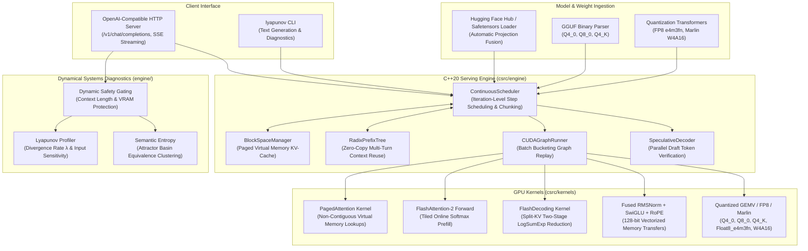

# Lyapunov Engine

> **Custom CUDA LLM Inference Engine with Dynamic Trajectory & Uncertainty Analysis**

LLM inference runtime and CUDA operator library implemented in C++20, CUDA, and PyTorch extension bindings.

---

## 1. System Architecture



---

## 2. Supported Model Architectures & Formats

### Supported Architectures (Families)
* **LLaMA Architecture (Mistral, Mixtral, Yi, SmolLM, Vicuna, OpenLLaMA)**: Autoregressive transformer decoders utilizing RMSNorm pre-normalization, SwiGLU feedforward projections, and Rotary Position Embeddings (RoPE) with Multi-Head (MHA) and Grouped-Query Attention (GQA).
* **Qwen Architecture (Qwen)**: Dense autoregressive models with tied/untied embedding vocabularies, grouped query layouts, and fused projection layers.
* **DeepSeek Architecture (DeepSeek, MoE Attention)**: Multi-Head and Multi-Query Attention pipelines with interleaved SwiGLU activation paths and normalization blocks.

### Supported File Formats & Checkpoint Types
* **Hugging Face Hub / Local Safetensors (`.safetensors`, `.bin`)**: Direct download and ingestion with fused gate-up projection layers.
* **GGUF Binary Format (`.gguf`)**: Zero-copy binary parser supporting `Q4_0`, `Q8_0`, and `Q4_K` block quantization.
* **Native FP8 Tensors (`Float8_e4m3fn`)**: Accelerated FP8 matrix operations with per-tensor dynamic scale factors.
* **Marlin W4A16 Checkpoints**: 4-bit integer weights packed 8 nibbles per `int32` for Tensor Core GEMV execution across batch sizes $B \in [1, 64]$.

---

## 3. Technical Components

### GPU Operators (`csrc/kernels/`)
1. **Fused RMSNorm + SwiGLU (`fused_rmsnorm_swiglu.cu`)**: Single-pass warp reduction with 128-bit vectorized memory accesses (`float4`, `half2`).
2. **FlashAttention-2 Forward (`flash_attn_v2.cu`)**: Online softmax scaling with double-buffered shared memory tiling for sequence prefill.
3. **Split-KV FlashDecoding (`flash_decoding.cu`)**: Partitions sequence dimension across thread blocks with a two-stage log-sum-exp reduction kernel for single-token decode.
4. **PagedAttention (`paged_attention.cu`)**: Reads non-contiguous physical KV-cache blocks via lookup table (`block_table`) eliminating external memory fragmentation.
5. **Fused RoPE & Paged Write (`fused_rope_paged.cu`)**: Evaluates Rotary Position Embeddings in registers and writes directly into physical cache blocks without global memory roundtrips.
6. **Quantization Operators (`quant_ops.cu`)**:
   - **GGUF Block Dequantization & GEMV**: Direct inference over `Q4_0`, `Q8_0`, and `Q4_K` checkpoints.
   - **Hardware FP8 Matrix Multiply**: `Float8_e4m3fn` linear operations with per-tensor and per-channel scaling.
   - **Marlin W4A16 Tensor Core GEMV**: 4-bit packed integer matrix multiplication across batch dimensions $B \in [1, 64]$.
7. **Parallel Speculative Verifier (`speculative.cu`)**: GPU rejection sampling kernel verifying $K$ draft tokens in a single forward pass.

### C++20 Serving Runtime (`csrc/engine/`)
1. **`BlockSpaceManager`**: Paged virtual memory allocator with reference counting.
2. **`ContinuousScheduler`**: Continuous iteration-level scheduler dynamically batching prefill and decode requests without padding tokens.
3. **`RadixPrefixTree` / `RadixPrefixCache`**: Zero-copy KV-cache sharing for multi-turn conversations and static system prompts.
4. **`CUDAGraphRunner`**: Static execution graph manager with batch bucketing ($B \in \{1, 2, 4, 8, 16, 32, 64\}$) to eliminate host kernel launch overhead.
5. **Tensor Parallelism (`distributed/tensor_parallel.py`)**: `ColumnParallelLinear` and `RowParallelLinear` with ring `all_reduce` collective communication.

### Stability & Uncertainty Diagnostics (`python/lyapunov_engine/engine/`)
1. **Semantic Entropy (`entropy.py`)**: Evaluates multi-path generations to measure clustering across semantic attractor basins, providing calibrated uncertainty scores.
2. **Lyapunov Divergence Profiler (`lyapunov.py`, `benchmarks/bench_lyapunov.py`)**: Measures token and hidden-state divergence rates ($D(t) \sim e^{\lambda t}$) under prompt perturbations.
3. **Dynamic Safety Gating (`api_server.py`)**: Two-tier memory and context protection ($S \le 64\text{k}$ full diagnostics, $64\text{k} < S \le 128\text{k}$ lightweight, $S > 128\text{k}$ graceful bypass).

---

## 4. Directory Structure

```
lyapunov-engine/
├── CMakeLists.txt                 # CMake C++20 / CUDA build configuration
├── setup.py                       # PyTorch C++ extension build script
├── pyproject.toml                 # Packaging metadata & CLI entrypoints
├── .github/workflows/ci.yml       # GitHub Actions CI/CD workflow pipeline
├── csrc/
│   ├── include/
│   │   ├── kernels/               # Kernel headers (fused_ops, flash_attn, paged_attn, quant_ops, fused_rope, speculative)
│   │   ├── engine/                # C++ engine headers (block_manager, scheduler, cuda_graph, prefix_tree)
│   │   └── utils/                 # Vector types, warp primitives, logging
│   ├── kernels/                   # CUDA kernel implementations (.cu)
│   ├── engine/                    # C++ engine implementations (.cpp)
│   └── bindings.cpp               # PyTorch C++ extension and PyBind11 bindings
├── python/
│   └── lyapunov_engine/
│       ├── ops.py                 # Operator bindings with eager fallbacks
│       ├── models/                # Architecture definitions, GGUF loader, safetensors loader, FP8 & Marlin converters
│       ├── engine/                # LLMEngine, sampling, entropy, lyapunov, speculative, prefix cache, cuda graph
│       ├── distributed/           # Tensor parallelism (ColumnParallel, RowParallel, ParallelEmbedding)
│       ├── server/                # OpenAI-compatible FastAPI server & Pydantic schemas
│       └── entrypoints/           # CLI tools for text generation and server hosting
├── tests/                         # Automated unit test suite (202 tests)
└── benchmarks/                    # Kernel microbenchmarks and serving throughput tests
```

---

## 5. Build and Installation

### Prerequisites
- Linux x86_64
- Conda environment: `lyapunov-engine`
- C++ Compiler: GCC $\ge$ 11 (C++20 standard)
- CUDA Toolkit: CUDA $\ge$ 12.0
- Python $\ge$ 3.10 with PyTorch $\ge$ 2.5 (`cu124`)

### Build Python Extension
```bash
conda run -n lyapunov-engine pip install --no-build-isolation -e .
```

---

## 6. Verification and Benchmarks

### Run Unit Tests
```bash
conda run -n lyapunov-engine pytest tests/ -v
```

### Run Microbenchmarks
```bash
conda run -n lyapunov-engine python benchmarks/bench_kernels.py --all
```

### Run Lyapunov Stability Profiler
```bash
conda run -n lyapunov-engine python benchmarks/bench_lyapunov.py --context-lens 32 128 512 1024
```

---

## 7. Server & CLI Execution Examples

### Start OpenAI-Compatible API Server
```bash
conda run -n lyapunov-engine lyapunov serve \
    --model Qwen/Qwen2.5-1.5B-Instruct \
    --host 0.0.0.0 \
    --port 8000
```

### Start Server with Local GGUF Checkpoint
```bash
conda run -n lyapunov-engine lyapunov serve \
    --model /path/to/qwen2.5-1.5b-instruct-q4_0.gguf \
    --host 0.0.0.0 \
    --port 8000
```

### Send Chat Completion Request with Stability Diagnostics
```bash
curl http://localhost:8000/v1/chat/completions \
  -H "Content-Type: application/json" \
  -d '{
    "model": "Qwen/Qwen2.5-1.5B-Instruct",
    "messages": [
      {"role": "user", "content": "Explain the role of attractor basins in high-dimensional representations."}
    ],
    "temperature": 0.7,
    "max_tokens": 128,
    "include_stability_diagnostics": true,
    "stream": false
  }'
```

### Run Text Generation via CLI
```bash
conda run -n lyapunov-engine lyapunov generate \
    --model Qwen/Qwen2.5-1.5B-Instruct \
    --prompt "Explain iteration-level scheduling in LLM serving:" \
    --max-tokens 128
```
